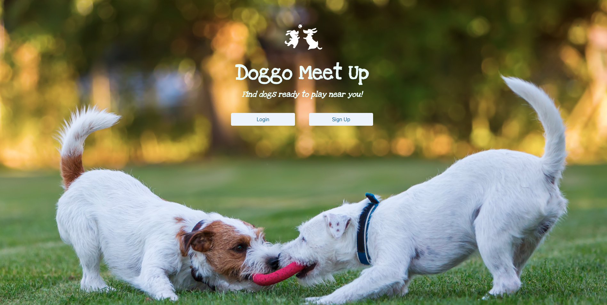

# doggo-meet-up

## Description:

“Doggo Meet Up” is an application for dog owners to use when looking for nearby dogs to play with. This app is helpful when dog owners need to get their dogs’ energy out and to socialize with other dogs.

Users can input their own information, including dog name, size, breed, and gender, zip code of residence, preferred park, preferred play time and days, and contact email. Then, users can view other profiles that match their zip code. Also, users can update their profile information.

If a user finds a suitable match, they can contact the other user via email by clicking on the “Contact Me” button.

### User Story:

> AS A dog owner,
>
> I WANT TO exercise my dog and socialize it with other dogs,
>
> SO THAT my dog is happy and healthy.

### Acceptance Criteria:

> GIVEN a login page with a brief description of the app
>
> WHEN a user creates an account with their email and password
>
> THEN their email and password are securely saved, and they are taken to the user profile page.
>
> WHEN a user enters their profile information, including dog name, size, breed, and gender, zip code of residence, preferred park, preferred play time and days, and contact email
>
> THEN their profile is stored in the user database.
>
> WHEN the user clicks “View Profiles Near Me”
>
> THEN the profiles of other users with matching zip codes are displayed.
>
> WHEN the user clicks “Contact Me” on another user’s profile
>
> THEN the default email program opens and populates the TO field of the email with the address.
>
> WHEN the user clicks “Update Profile”
>
> THEN the user can input new profile information to update their stored data.
>
> WHEN the user clicks “Log Out”
>
> THEN the session is ended and they are returned to the Login Page.

## Technologies Used

### CSS Framework:

[Bulma](https://bulma.io/)

### Database/Models:

- [MySQL](https://dev.mysql.com/doc/relnotes/mysql/8.0/en/news-8-0-29.html)
- [Sequelize](https://sequelize.org/docs/v6/)
- [dotenv](https://www.npmjs.com/package/dotenv)
- [Express Handlebars](https://www.npmjs.com/package/express-handlebars)
- [Express Session](https://www.npmjs.com/package/express-session)

## Deployed Application

### [Heroku](https://hidden-reaches-52880.herokuapp.com/)

---

### Homepage

### Login Page

### Sign Up Page

### Profile Page

### Search Page

### Search Results

---

© 2022 Code Unleash: Mikayla Vosseller, Kevin Wang, Meng Xing, Qiling Deng
